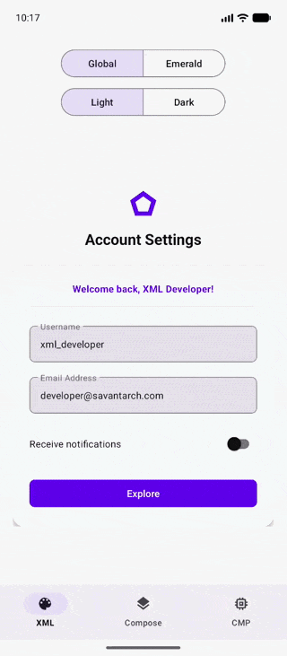
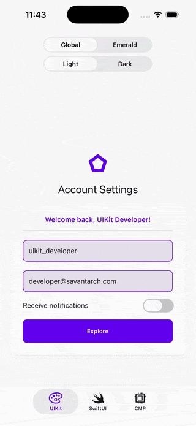

# KMP Design System (Theming & Resource Engine)

[](https://central.sonatype.com/artifact/com.savantarch/design-system)
[](https://savantarch.github.io/kmp-design-system/)
[](LICENSE)
[](https://kotlinlang.org/docs/multiplatform.html)

A fast, lightweight, and type-safe Kotlin Multiplatform (KMP) engine to manage application themes,
share design tokens, and bundle localized strings and graphics synchronously across Compose
Multiplatform, Jetpack Compose, Android XML Layouts, SwiftUI, and iOS UIKit.

Instead of relying on heavy code generation, `kmp-design-system` translates design tokens and assets
directly into standard platform-native resource structures (such as Android XML Theme Attributes,
iOS Asset Catalogs, and iOS localized strings). This enables completely synchronous, zero-copy, and
frame-rate-safe resource rendering across all native and Compose UI stacks.

For a deep-dive conceptual explanation of the challenges of KMP resource sharing and how the **Resource Contracts** pattern solves them, see [docs/resource_contracts_concept.md](docs/resource_contracts_concept.md).

Below is the sample application demonstrating dynamic theme variants (Global Purple vs. Emerald Green), light/dark mode swaps, localized greeting text, and vector image rendering.

| Android                                                          | iOS                                                      |
|------------------------------------------------------------------|----------------------------------------------------------|
|  |  |

## Table of Contents
- [Compatibility & Prerequisites](#compatibility--prerequisites)
- [Gradle Setup](#gradle-setup)
  - [Add Plugin Repository](#add-plugin-repository)
  - [Apply and Configure the Plugin](#apply-and-configure-the-plugin)
  - [Add the Runtime Dependency](#add-the-runtime-dependency)
- [Usage & Architecture](#usage)
  - [Colors](#colors)
  - [Shapes](#shapes)
  - [Typography](#typography)
  - [Strings (with expect/actual)](#strings)
  - [Images (with expect/actual)](#images)
  - [Themes](#themes)
- [Running Local Showcase Builds](#running-local-showcase-builds)
- [Contributing](#contributing)
- [License](#license)

## Compatibility & Prerequisites
To use this engine, your development environment and target project must satisfy the following:
* **Gradle**: `8.5` or higher
* **Kotlin**: `2.1.0` or higher (tested with `2.1.20`)
* **Compose Multiplatform**: `1.8.0` or higher (tested with `1.8.2`)
* **Android target**: minSdk `29`, compileSdk `36`
* **iOS target**: iOS `15.0` or higher (Xcode `15.0+` required for framework assembly)

## Gradle Setup

To use the design system library in any KMP application, configure it using Gradle's Version Catalog.

### 1. Configure the Version Catalog

Add the design system plugin and runtime dependency to your client application's version catalog (`gradle/libs.versions.toml`):

```toml
[versions]
# Check the live Maven Central badge at the top for the latest release version
design-system = "1.0.0-beta08"

[libraries]
design-system = { group = "com.savantarch", name = "design-system", version.ref = "design-system" }

[plugins]
design-system = { id = "com.savantarch.designsystem", version.ref = "design-system" }
```

### 2. Apply and Configure the Plugin

In your shared UI module's `build.gradle.kts` (e.g. `:app-shared`), apply the plugin using its catalog alias and configure the `designSystem` extension block:

```kotlin
plugins {
    alias(libs.plugins.design.system)
}

designSystem {
    // Directory containing Apple .xcassets folder
    // default: "src/iosMain/resources/Assets.xcassets"
    xcassetsDir.set(layout.projectDirectory.dir("src/iosMain/resources/Assets.xcassets"))

    // Directory containing raw localizations and assets
    // default: "src/iosMain/resources"
    resourcesDir.set(layout.projectDirectory.dir("src/iosMain/resources"))

    // Optional: iOS deployment target
    // default: "15.0"
    minimumDeploymentTarget.set("15.0")

    // Optional: Target iOS devices
    // default: ["iphone", "ipad"]
    targetDevices.set(listOf("iphone", "ipad"))
}
```

### 3. Add the Runtime Dependency

Add the core design system runtime library to your shared UI module's `commonMain` dependencies:

```kotlin
kotlin {
    sourceSets {
        commonMain.dependencies {
            implementation(libs.design.system)
        }
    }
}
```

## Usage

The `:design-system` module is app-agnostic. It provides token interfaces, asset contracts, and the
core `DesignSystemTheme` Composable. Client applications are responsible for satisfying these
contracts by defining concrete values for standard tokens (which are based on Material 3 designs),
and optionally extending them with custom tokens.

Here is how each type of design resource is modeled, extended, and provided via
`staticCompositionLocalOf`:

> [!TIP]
> **Use Delegation Wrappers (`AppXyz`)**
> Even if your application does not initially require custom design tokens, we recommend that you
> always declare custom client delegation wrapper classes (e.g. `AppColors`, `AppShapes`,
`AppTypography` wrapping their library-level `DsColors`, `DsShapes`, `DsTypography` equivalents) and
> expose them on your public `AppTheme` API.
>
> Doing so future-proofs your theme implementation: if you need to introduce new custom tokens in
> the future, you can add them directly to your application wrappers without altering `AppTheme`'s
> return types, preventing breaking API changes across your Kotlin and Swift codebases.

#### Colors

* **Core Model**: The library exposes the `DsColors` interface containing standard Material 3 color
  properties (e.g., `primary`, `background`, `surface`). The client app must define values for these
  properties.
* **Custom Tokens**: The client app can define extra custom colors (e.g., `promoBrand`) wrapping the
  base `DsColors`.
* **Definition**:
  ```kotlin
  class AppColors(
      private val base: DsColors,
      val promoBrand: Long
  ) : DsColors by base
  ```

#### Usage in the 5 UI Stacks:

* **Compose Multiplatform (Android & iOS)**:
  ```kotlin
  Box(modifier = Modifier.background(AppTheme.colors.background.toColor()))
  ```
* **Jetpack Compose (Android)**:
  ```kotlin
  Text(text = "Hello", color = AppTheme.colors.primary.toColor())
  ```
* **Android XML Layouts**:
  ```xml
  <View android:background="?attr/colorPrimary" />
  ```
* **SwiftUI (iOS)**:
  ```swift
  @ObservedObject private var theme = AppThemeSwift.shared
  Text("Hello").foregroundColor(theme.colors.primary.color)
  ```
* **UIKit (iOS)**:
  ```swift
  view.backgroundColor = AppThemeSwift.shared.colors.background.uiColor
  ```

### Shapes

* **Core Model**: The library exposes the `DsShapes` interface containing shape tokens (e.g.,
  `small`, `medium`, `large`). The client app must define values for these properties.
* **Custom Tokens**: The client app can define custom shapes (e.g., `buttonShape`) using class
  delegation.
* **Definition**:
  ```kotlin
  class AppShapes(
      private val base: DsShapes,
      val buttonShape: ShapeAppearance
  ) : DsShapes by base
  ```

#### Usage in the 5 UI Stacks:

* **Compose Multiplatform (Android & iOS)**:
  ```kotlin
  Box(modifier = Modifier.clip(AppTheme.shapes.buttonShape.toComposeShape()))
  ```
* **Jetpack Compose (Android)**:
  ```kotlin
  Surface(shape = AppTheme.shapes.medium.toComposeShape()) { }
  ```
* **Android XML Layouts**:
  ```xml
  <View android:background="?attr/shapeMedium" />
  ```
* **SwiftUI (iOS)**:
  ```swift
  Text("Button").cornerRadius(theme.shapes.medium.topLeft)
  ```
* **UIKit (iOS)**:
  ```swift
  @ObservedObject private var theme = AppThemeSwift.shared
  button.layer.cornerRadius = AppThemeSwift.shared.shapes.medium.topLeft
  ```

### Typography

* **Core Model**: The library exposes the `DsTypography` interface containing text style tokens (
  e.g., `titleLarge`, `bodyMedium`). The client app must define values for these properties.
* **Custom Tokens**: The client app can define custom typography styles (e.g., `promoTitle`) using
  class delegation.
* **Definition**:
  ```kotlin
  class AppTypography(
      private val base: DsTypography,
      val promoTitle: FontSpec
  ) : DsTypography by base
  ```

#### Usage in the 5 UI Stacks:

* **Compose Multiplatform (Android & iOS)**:
  ```kotlin
  Text("Header", style = AppTheme.typography.titleLarge)
  ```
* **Jetpack Compose (Android)**:
  ```kotlin
  Text("Sub", style = AppTheme.typography.bodyMedium)
  ```
* **Android XML Layouts**:
  ```xml
  <TextView
      android:textSize="?attr/fontSizeTitle"
      android:textColor="?attr/colorOnSurface" />
  ```
* **SwiftUI (iOS)**:
  ```swift
  @ObservedObject private var theme = AppThemeSwift.shared
  Text("Header").font(Font(theme.typography.titleLargeFont))
  ```
* **UIKit (iOS)**:
  ```swift
  titleLabel.font = AppThemeSwift.shared.typography.titleLargeFont
  ```

### Strings

* **Core Model**: The library does not define any core strings. The custom Gradle plugin packages
  localized string resource folders (`.lproj`) into the iOS bundle. The client app defines its own
  resource keys (typically as an enum) and platform-specific resolvers.
* **Storage Location**: Localized text is placed directly in standard native resource folders within
  your shared module:
    * **Android**: Placed in standard XML values
      under [strings.xml](app-shared/src/androidMain/res/values/strings.xml) (e.g.,
      `values/strings.xml`, `values-es/strings.xml`).
    * **iOS**: Standard Apple localization directories inside the resources folder (e.g.,
      `src/iosMain/resources/en.lproj/Localizable.strings`).
* **Definition**:
  Define a localized resource enum in `commonMain` implementing `DsStrings`. In the platform source
  sets, implement the platform-specific contract interfaces:
    * **Android (`AndroidDsStrings`)**: Maps each key to its style theme attribute ID (
      `R.attr.welcomeMsg`) and active theme variant.
    * **iOS (`IosDsStrings`)**: Maps each key to its exact Cocoa localization dictionary key (
      `"welcomeMsg"`).

  ```kotlin
  // commonMain
  expect enum class AppStrings : DsStrings {
      WELCOME_MSG
  }

  // androidMain
  actual enum class AppStrings : AndroidDsStrings {
      WELCOME_MSG;

    override fun toAttrId(): Pair<Int, String> =
        Pair(R.attr.welcomeMsg, currentVariant.name)
  }

  // iosMain
  actual enum class AppStrings : IosDsStrings {
      WELCOME_MSG;

      override fun toIosKey(): String = "welcomeMsg"
  }
  ```

  #### Usage in the 5 UI Stacks:

  * **Compose Multiplatform (Android & iOS)**:
    ```kotlin
    Text(text = stringResource(AppStrings.APP_TITLE))
    ```
  * **Jetpack Compose (Android)**:
    ```kotlin
    Text(text = stringResource(AppStrings.WELCOME_MSG))
    ```
  * **Android XML Layouts**:
    ```xml
    <TextView android:text="?attr/welcomeMsg" />
    ```
  * **SwiftUI (iOS)**:
    ```swift
    Text(AppStrings.appTitle.localized)
    ```
  * **UIKit (iOS)**:
    ```swift
    titleLabel.text = AppStrings.appTitle.localized
    ```

  ### Images

  * **Core Model**: The library does not define any core images. The custom Gradle plugin compiles and
    packages the `.xcassets` catalog into `Assets.car` inside the iOS bundle. The client app defines
    its own image references/contracts and platform-specific mapping.
  * **Storage Location**: Raw vector files and asset catalogs are placed in standard platform-specific
    resource folders:
      * **Android**: SVGs/drawables placed directly under `src/androidMain/res/drawable/`.
      * **iOS**: Vector asset catalogs located inside `src/iosMain/resources/Assets.xcassets/`.
  * **Definition**:
    Define an image asset enum in `commonMain` implementing `DsImages`. In the platform source sets,
    implement the platform-specific contract interfaces:
      * **Android (`AndroidDsImages`)**: Maps each key to its style theme attribute ID (
        `R.attr.logo`).
      * **iOS (`IosDsImages`)**: Maps each key to its Apple Asset Catalog asset name (`"ic_logo"`).

    ```kotlin
    // commonMain
    expect enum class AppImages : DsImages {
        LOGO
    }

    // androidMain
    actual enum class AppImages : AndroidDsImages {
        LOGO;

        override fun toAttrId(): Int = R.attr.logo
    }

    // iosMain
    actual enum class AppImages : IosDsImages {
        LOGO;

        override fun toImageName(): String = "ic_logo"
    }
    ```

#### Usage in the 5 UI Stacks:

* **Compose Multiplatform (Android & iOS)**:
  ```kotlin
  DsImage(
      image = AppImages.LOGO,
      contentDescription = "Logo",
      modifier = Modifier.size(64.dp)
  )
  ```
* **Jetpack Compose (Android)**:
  ```kotlin
  DsImage(image = AppImages.LOGO, contentDescription = "Logo")
  ```
* **Android XML Layouts**:
  ```xml
  <ImageView android:src="?attr/logo" android:tint="?attr/colorPrimary" />
  ```
* **SwiftUI (iOS)**:
  ```swift
  Image(uiImage: AppImages.logo.uiImage)
      .foregroundColor(theme.colors.primary.color)
  ```
* **UIKit (iOS)**:
  ```swift
  logoImageView.image = AppImages.logo.uiImage
  logoImageView.tintColor = AppThemeSwift.shared.colors.primary.uiColor
  ```

* **Advanced Image Loading (Coil 3)**:
    * For advanced, asynchronous image loading with disk caching, transformations, or transitions,
      you can bridge `DsImages` with **Coil 3** using our platform-agnostic helper `toCoilModel()`,
      or by registering a custom Coil 3 `Mapper`.
    * See the [Coil Integration Guide](docs/coil_integration.md) for full setup instructions and
      code examples.

### Themes

* **Core Model**: The client app writes its custom `AppTheme` Composable. It resolves the current
  theme variant tokens, passes them to a `CompositionLocalProvider` (e.g., `LocalAppColors`,
  `LocalAppShapes`, `LocalAppTypography`), and maps them to standard `MaterialTheme`:
  ```kotlin
  @Composable
  fun AppTheme(
      variant: AppThemeVariant = AppThemeSettings.currentVariant,
      isDark: Boolean = AppThemeSettings.isDark,
      content: @Composable () -> Unit
  ) {
      val (appColors, colorScheme) = remember(variant, isDark) {
          val resolved = variant.resolveColors(isDark)
          resolved to resolved.toColorScheme(isDark)
      }
      val (appShapes, shapes) = remember(variant) {
          val resolved = variant.resolveShapes()
          resolved to resolved.toShapes()
      }
      val (appTypography, typography) = remember(variant) {
          val resolved = variant.resolveTypography()
          resolved to resolved.toTypography()
      }

      CompositionLocalProvider(
          LocalAppColors provides appColors,
          LocalAppShapes provides appShapes,
          LocalAppTypography provides appTypography
      ) {
          MaterialTheme(
              colorScheme = colorScheme,
              shapes = shapes,
              typography = typography,
              content = content
          )
      }
  }
  ```

> [!NOTE]
> The sample
> app's [AppThemeSpecs.kt](app-shared/src/commonMain/kotlin/com/savantarch/shared/AppThemeSpecs.kt)
> provides a full, concrete example of how to implement colors, shapes, typography, platform-specific
> string/image maps, and dynamic theme switching.

## Running Local Showcase Builds

### Android Build

Build the Android debug configurations:

```bash
./gradlew assembleDebug
```

### iOS Build

> [!IMPORTANT]
> **macOS & Xcode Requirement**  
> Building and linking iOS targets requires a macOS machine with Xcode 15.0 or higher installed.

Clean and build the iOS framework package and simulator targets:

```bash
xcodebuild -project app-ios/app-ios.xcodeproj \
           -scheme app-ios \
           -destination "generic/platform=iOS Simulator" \
           -configuration Debug \
           clean build
```

## Contributing
We welcome contributions to help improve `kmp-design-system`! Whether you are reporting a bug, suggesting a new design token, or submitting a Pull Request, please follow these guidelines:
1. **Report Issues**: Open an issue on GitHub detailing the bug, unexpected behavior, or feature request.
2. **Submit Pull Requests**:
   - Create a feature branch for your changes (do not commit directly to `main`).
   - Write clear, concise commit messages and ensure all existing checks (Android compilation, iOS linking) pass.
   - For major or breaking changes, please open an issue first to discuss your planned modifications.

## License
This project is licensed under the **MIT License**. See the [LICENSE](LICENSE) file in the root directory for the full legal text.
