# Resource Contracts Pattern: Conceptual Background & Architecture

This document provides a deep-dive conceptual explanation of the **Resource Contracts** pattern, analyzing its architectural advantages over other Kotlin Multiplatform (KMP) resource-sharing solutions.

---

## 1. The Challenges of KMP Resource Sharing

When building a KMP application with multiple UI frameworks (such as XML Views and Jetpack Compose on Android, UIKit and SwiftUI on iOS, and Compose Multiplatform across both platforms), sharing design resources presents distinct integration challenges. 

Most existing solutions rely on concrete resource packaging models, which can be categorized into two approaches:

### A. Runtime Containment (e.g., JetBrains `composeResources`)
This model compiles raw resource files directly into the shared module's framework resources and loads them at runtime using a custom engine. 
* **Friction**: Because it is tightly coupled to the JetBrains Compose rendering loop, it relies on asynchronous coroutine scopes to load resources. When fetching standard, synchronous layout properties (like paddings, fonts, or localized strings), this forced asynchrony creates a temporal gap, leading to visual pops, layouts flashing, and redundant rendering cycles. 
* **Platform Constraints**: It bypasses optimized native compilers like Xcode's `actool` or Android's `aapt2`, skipping PNG optimization and localized string binary packing. On iOS, SwiftUI and UIKit teams are forced to interact with asynchronous Kotlin wrappers rather than Cocoa-native localization systems. On Android, View layouts cannot resolve these assets directly in standard XML templates.

### B. Codegen and Transcoding (e.g., IceRock `moko-resources`)
This model runs Gradle tasks to generate platform-specific files, exporting standard XML resources/values on Android and compiled iOS `.bundle` packages containing native `.strings` and `.xcassets` on iOS.
* **Friction**: Every minor adjustment to a design token or localized string requires triggering a Gradle compilation task, causing build delays and IDE indexing lag. 
* **Maintenance & Vendor Lock-In**: Static frameworks on iOS (`isStatic = true`) cannot natively pack resource bundles, requiring complex link-time Xcode shell script phases to copy the generated `.bundle` into the main application. Over time, scattering library-specific generated accessors across many downstream feature modules creates tight coupling that makes migrating off the library a high-risk refactoring undertaking.

---

## 2. The Resource Contracts Pattern

The **Resource Contracts** pattern bypasses custom runtimes and heavy compilation plugins by separating **Design Decisions** (managed centrally in Kotlin) from the **Delivery Mechanism** (resolved synchronously by each platform). 

```
                               ┌─────────────────┐
                               │   commonMain    │
                               │  (Interfaces)   │
                               └────────┬────────┘
                                        │
                    ┌───────────────────┴───────────────────┐
                    ▼                                       ▼
          ┌──────────────────┐                    ┌──────────────────┐
          │   androidMain    │                    │     iosMain      │
          │ (Context Theme)  │                    │ (NSBundle main)  │
          └──────────────────┘                    └──────────────────┘
```

You define interfaces in `commonMain` and satisfy them with platform-specific implementations (`androidMain` and `iosMain`). 

Platform-native resources (such as standard `.xcassets` catalogs, localized strings, or raw SVGs) are co-located directly inside the resource directories of your KMP module (e.g., `app-shared/src/iosMain/resources/` and `app-shared/src/androidMain/res`). During compilation, native platform tools package them into standard native formats.



---

## 3. iOS Asset Compilation Pipeline

On iOS, vectors and image assets must be compiled using Apple's native command-line compiler (`actool`). 

The custom `compileAssetCatalog` Gradle task automatically runs the native Apple CLI compiler (`actool`) to translate SVG/vector assets inside the raw `.xcassets` directory into a binary `Assets.car` file inside the `.bundle` output directory:



* **Info.plist Requirement**: iOS and the CoreUI framework enforce validation on any dynamic `.bundle` containing a compiled asset catalog (`Assets.car`). The bundle must contain a valid, properly configured `Info.plist` containing at least `CFBundleIdentifier`, `CFBundleName`, and `CFBundlePackageType`. If this `Info.plist` is missing, CoreUI silently fails to load the catalog, causing runtime lookups (like `UIImage(named:in:compatibleWith:)`) to return `nil`. We include this minimal `Info.plist` directly in our co-located resource folder to satisfy iOS validation checks out of the box.

---

## 4. Key Takeaways

1. **Synchronous Performance**: All design properties are resolved synchronously at the layout layer (no state tracking, callback coroutine flows, or observers), completely eliminating layout-popping and rendering latency.
2. **Zero Codegen Overhead**: It eliminates third-party codegen plugins. This prevents build-time lag, IDE indexing delays, and vendor lock-in risks.
3. **Dynamic Contextual Themes**: Drive token resolution via custom classes and settings. On Android, the implementation resolves attributes dynamically from the active `Context` theme (`?attr/...`), allowing a single shared component to automatically morph its styling based on the Activity or Fragment hosting it.
4. **Frictionless Native Integration**: Android XMLs can resolve attributes dynamically using native theme attributes. iOS developers can continue using standard localized strings (`NSLocalizedString`), Asset Catalogs (`UIImage(named:)`), and Xcode localization editors natively.
5. **Code-Only Frameworks**: The compiled KMP `xcframework` remains completely code-only (zero assets embedded). Because there are no resource directories inside the static framework, it bypasses physical bundle copy traps.
